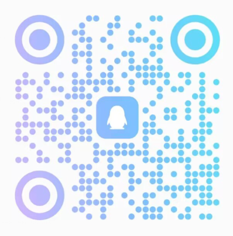

<h1 align="center">🧀 GoAmzAI = GO Amazing AI</h1>

全新精美的个人、团队、企业私有化AIGC平台

## 介绍
**介绍必看：** 产品说明、演示站、截图等相关内容请 [🧀 进入产品介绍](https://ipdj3sibjm.feishu.cn/docx/ARgjdOpTcohy2txfcPbclVbvnOf) 查看，本仓库仅含有基本介绍，且下述介绍内容可能不是最新内容，最新内容请均以此[🧀 产品介绍链接](https://ipdj3sibjm.feishu.cn/docx/ARgjdOpTcohy2txfcPbclVbvnOf)为准。

## 演示站点
- [👀 立即进入体验](https://demo6.goamzai.com)

## 技术架构
- 前端：Vue3 + NaiveUI
- 后端：Golang + Gin
- 数据支持：MySQL5.7 + Redis

## 扫码获取
### 微信扫码
> 备注：AIGC咨询

### QQ扫码
> 备注：AIGC咨询

## 你需要准备
- 域名
- 服务器：最低1C1G（CPU 1核心 + 1G内存）即可支持
- 对话模型平台API密钥（可选，如果你要使用对话功能）
- 绘画模型平台API密钥（可选，如果你要使用绘画功能）
- 其他模块（依据自己想法开启与否决定是否准备）：例如短信、邮件、内容审核平台等等

## 特性功能
- [x] **极速部署，宝塔5分钟部署完成，低内存高并发，内存占用不到100MB！**
- [x] **配置简单快捷，配置文件仅需数据库配置即可启动**
- [x] **强大的在线配置框架及丝滑版的体验，95%数据都可以后台在线统一管理！**
- [x] **完美的自适应，支持手机、平板、电脑等多种尺寸设备的浏览器在线访问！**
- [x] ChatGPT + Azure OpenAI + 文心一言 + 讯飞星火 + 智谱 + 自定义对话模型支持（可集成市面上任何LLM模型）
- [x] 🔥 **自定义对话模型支持：包括模型名称、别名、单次积分扣除数量等等（自定义模型+第三方中转平台接入支持：此组合操作可以接入任意模型，例如各种GPTs、本地模型、新发布的模型等等～）**
- [x] 🎄 **语音实时识别对话交互：在对话里面点击语音按钮后直接说话，让AI与你实时语音对话**
- [x] 🔥 **对话账号池（无限量）：支持OpenAI、Azure、文心一言、讯飞星火、智谱、OneAPI等平台接入**
- [x] 🔥 **对话多会话隔离支持、参数独立配置云端存储、消息云端漫游**
- [x] 🔥 **内容安全多层过滤：内置词库 -> 自定义词库 -> 第三方（百度内容审核）安全检测，可同时启用**
- [x] 🍃 **对话多模态支持：支持官方图像多模态+prompt携带任意格式文件多模态的多种支持，同时支持自定义对话模型开启多模态支持**
- [x] 🍃 **文档解析对话：支持PDF文档解析对话**
- [x] 🔥 **开放式对话插件：已支持联网查询、IP信息、天气查询、快递查询等13+款插件，同时可结合开发文档扩展你自己的插件！支持ECMAScript5.1引擎、PHP、Python、NodeJS进行开发（插件持续增加中...）**
- [x] 🔥 **AI视频支持：支持文生视频、图生视频，支持SVD、Animate Diff、Stable Diffusion Animation、第三方API视频模型等，同时具有多模型切换及参数完全调配支持**
- [x] 🔥 **AI音乐支持：支持AI音乐生成，包含专业模式和简易模式等，具有非常完善的参数调控面板，同时持续对接各种主流音乐AI模型**
- [x] 🔥 **AI绘画支持：文生图、图生图、放大、微调、混图、咒语解析、平移、扩图、变幻、区域重绘、Seed值获取等众多功能**
- [x] 🍃 **DallE.3绘画支持：支持在绘画面板上对DallE.3的参数完全调控和生成**
- [x] 🍃 **StabilityAI绘画支持：支持在绘画面板上对Stable Image Ultra、Stable Image Core、Stable Diffusion 3、SDXL的参数调控和生成**
- [x] 🔥 **绘画账号池（无限量）：每个账号同时支持单独的并发线程设定，线程隔离。**
- [x] 🔥 **支持MJ-Proxy开源版及Plus版API适配，作为第三方绘画中转站集成，可同时多个平台轮询，并且可单独设置任务池大小**
- [x] ✨ **绘图服务在线启动、重启、关闭 + 队列数量实时查看**
- [x] 👾 **绘图普通/快速模式区分，可单独设置扣除积分**
- [x] 签到福利：用户可每日签到获得对应的设定积分
- [x] 思维导图：一键根据需求生成思维导图，可导出PNG或SVG
- [x] 绘画画廊：用户绘图公开展示（私有绘图不展示），包含点赞功能支持
- [x] 应用市场：可后台管理动态添加及其他管理
- [x] **用户系统：邮箱 + 手机号码（登陆 / 注册 / 找回密码 / 修改密码 / 验证码登陆等等）**
- [x] **支付系统：微信（支持扫码支付+JSAPI支持） / 支付宝（当面付、电脑网站支付） / 虎皮椒 / 彩虹易支付 / 自定义外链**
- [x] **第三方登录：QQ / 微信扫码（个人订阅号、未认证公众号、已认证服务号均支持） / 微信网页授权 / Github / Gitee / LinuxDo**
- [x] **推广模块：支持用户推广分佣模式，分佣所获得的奖励可以兑换套餐。**
- [x] 套餐系统：支持周期内每日重置 + 固定周期内总量多种方式
- [x] 对话Tokens消耗、单积分消耗多种模式支持
- [x] 兑换码系统（也可以称为卡密系统）支持
- [x] 站点在线DIY：例如主题色、LOGO、名称、SEO、区块圆角、自定义全局CSS、自定义全局流量统计等等均可在后台管理在线配置
- [x] 后台管理系统：与前台账户一体化，管理身份自动出现管理入口一键管理
- [x] 绘画服务在线管理：启动、停止、重启；可实时查看进行中的任务和等待队列数量
- [x] 邀请机制：好友邀请获得对应奖励，包含防止恶意自己邀请自己机制检测
- [x] 管理后台在线自定义全局各种模板：注册+登陆邮件模板、余额不足模板、默认对话提示、默认各类型Prompt等
- [x] 对话各个模型+绘画各个操作单独自定义扣除积分数量支持
- [x] 动态用户侧边栏菜单控制显隐
- [x] 用户端动态菜单（支持内嵌网页、外部链接跳转、内部路径跳转）
- [x] 对话记录PNG长图导出
- [x] 允许游客免登陆访问界面支持
- [x] 用户必须绑定手机或邮箱才可以使用支持
- [x] 用户自定义上传头像，包含头像的图像安全检测
- [x] 敏感词噪音去除开关和自定义正则支持
- [x] LOGO扫光动效支持
- [x] 实时封禁用户账户支持
- [x] 特性功能不止这一点，具体请查看我们的演示站为准：[进入演示站](https://demo6.goamzai.com/)

## 截图
> 截图请参考以下来源的数据：

- [官网截图展示](https://d.goamzai.com/screenshot/user.html)
- [产品介绍展示](https://ipdj3sibjm.feishu.cn/docx/ARgjdOpTcohy2txfcPbclVbvnOf#ZHCFdoKrTorPXKxPKrwcn8t8nyd)

